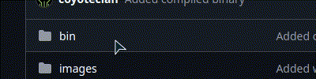
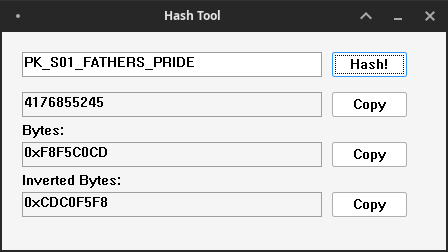

# USM-String-Hash-tool

This tool converts string to hash code by using a function created by Lemon Haze.

## Usage

- Download the compiled [executable file](https://github.com/coyoteclan/usm_string_hash_dictionary_tool/blob/main/bin/hashtool.exe) from the [binary folder](https://github.com/coyoteclan/usm_string_hash_dictionary_tool/tree/main/bin).



- Run the downloaded file.

- Type the input string in text box and smash the "Hash!" button.



## Compiling

This tool is comiled with mingw compiler on linux. I have no idea how to do it on windows.

Make sure you have installed `cmake` and `mingw-w64-i686-dev` (necessary for this compilation) or `mingw-w64` (to install the full toolchain).

Type the following commands to compile the tool.

```bash
mkdir build
cd build
cmake ..
make
```
Then find **hashtool.exe** in bin folder.

If you modify the manifest file, you will need to recreate the res.o file first.
```bash
i686-w64-mingw32-windres hashtool.rc -O coff -o hashtool.res.o
```
